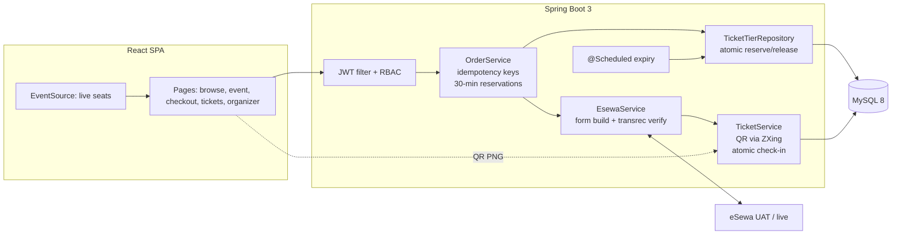

# TicketSewa — Event ticketing for Nepal

A full-stack event ticketing platform: organizers publish events with ticket tiers,
fans pay with **eSewa** (Nepal's wallet), and gates check people in with **QR codes**.
Built with **Spring Boot 3 + React + MySQL**.

## Why this project exists

Tutorial projects prove you can follow instructions. This one proves you can handle
the things that break in production:

| Feature | Hiring signal it demonstrates |
|---|---|
| Atomic seat reservation (conditional `UPDATE … WHERE sold + qty <= total`) | Concurrency safety — overselling is impossible even when 20 buyers race |
| Real eSewa integration (form flow + server-to-server `transrec` verification) | Real-money payments, not a simulated checkout |
| Idempotent payment verification (pessimistic order lock + unique `esewaRefId`) | Duplicate callbacks / double-clicks can't create duplicate tickets |
| Idempotency keys on order creation | Safe retries |
| QR tickets + atomic `VALID → USED` check-in | Exactly-once semantics at the gate |
| JWT auth with `ATTENDEE / ORGANIZER / ADMIN` roles + ownership checks | RBAC done properly |
| Live seat availability over Server-Sent Events | Real-time UI |
| Stale-reservation expiry (scheduled job releases unpaid seats) | Operational thinking |
| Concurrent integration tests (H2) for the race, the double callback, the double scan | Testing the scary paths, not the happy path |

## Architecture



## Quickstart (under 5 minutes)

**Option A — Docker (recommended)**
```bash
docker compose up --build
# frontend → http://localhost:3000 · API → http://localhost:8080
```

**Option B — local**
```bash
# 1. MySQL 8 running locally with a `ticketsewa` database
#    (or set DB_URL/DB_USER/DB_PASS env vars)
# 2. Backend
cd backend && mvn spring-boot:run
# 3. Frontend (new terminal)
cd frontend && npm install && npm run dev   # → http://localhost:5173
```

**Demo accounts** (seeded on first boot): `organizer@demo.np / organizer123`,
`fan@demo.np / fan12345`, `admin@demo.np / admin12345`.

**Try the full flow:** login as fan → open *Himalayan Beats* → buy 2 General tickets →
*Demo pay* → *My Tickets* shows QR codes → login as organizer → *Check-in* tab →
type a ticket code → `ADMITTED`. Scan it again → `ALREADY_USED`.

## eSewa: demo mode vs real payments

- **Demo mode** (`esewa.demo-mode=true`, default) simulates the entire eSewa
  round-trip in one click — no wallet or merchant account needed. The code path
  (order → verify → issue tickets) is identical; only the external call is stubbed.
- **Real payments:** set `esewa.demo-mode=false`, put your merchant code in
  `ESEWA_MERCHANT`, and point `payment-url`/`verification-url` at eSewa's live
  endpoints. The buyer is redirected to eSewa, pays with their wallet, and eSewa
  redirects back to `/payment/success?oid=&amt=&refId=` — the backend verifies
  server-to-server via `transrec` **before** issuing tickets. The redirect alone
  is never trusted.

## API overview

| Method & path | Auth | What it does |
|---|---|---|
| `POST /api/auth/register` · `POST /api/auth/login` | – | JWT auth |
| `GET /api/events` · `GET /api/events/{id}` | – | Published events |
| `GET /api/events/{id}/seats/stream` | – | SSE live seat counts |
| `POST /api/organizer/events` | ORGANIZER+ | Create event + tiers |
| `GET /api/organizer/events` | ORGANIZER+ | Own events + sales |
| `POST /api/orders` | user | Create order, reserve seats (idempotency key) |
| `POST /api/orders/{id}/payment-form` | owner | eSewa form fields |
| `POST /api/payments/verify` | owner | Verify eSewa callback, issue tickets |
| `POST /api/payments/demo/pay` | owner | Demo-mode payment |
| `GET /api/tickets/mine` · `GET /api/tickets/{id}/qr` | owner | Tickets + QR PNG |
| `POST /api/checkin` | organizer of event | Atomic gate check-in |

## Tests

```bash
cd backend && mvn test
```

- `InventoryRaceTest` — 20 threads × 5 seats on a 50-seat tier → exactly 10 succeed, `quantitySold` never exceeds capacity.
- `IdempotentVerificationTest` — the same eSewa callback delivered twice → one `PAID` transition, one set of tickets; same idempotency key → one order.
- `DoubleCheckinTest` — two gates scanning one QR simultaneously → exactly one `ADMITTED`.

## Configuration

All via environment variables (see `backend/src/main/resources/application.yml`):
`DB_URL`, `DB_USER`, `DB_PASS`, `JWT_SECRET`, `FRONTEND_URL`, `ESEWA_MERCHANT`,
`ESEWA_PAYMENT_URL`, `ESEWA_VERIFICATION_URL`, `ESEWA_SUCCESS_URL`,
`ESEWA_FAILURE_URL`, `ESEWA_DEMO_MODE`, `SEED_DEMO`.

## Tech

Java 17 · Spring Boot 3.2 (Web, Data JPA, Security, Validation) · MySQL 8 ·
jjwt · ZXing · React 18 + Vite + React Router · Docker Compose
